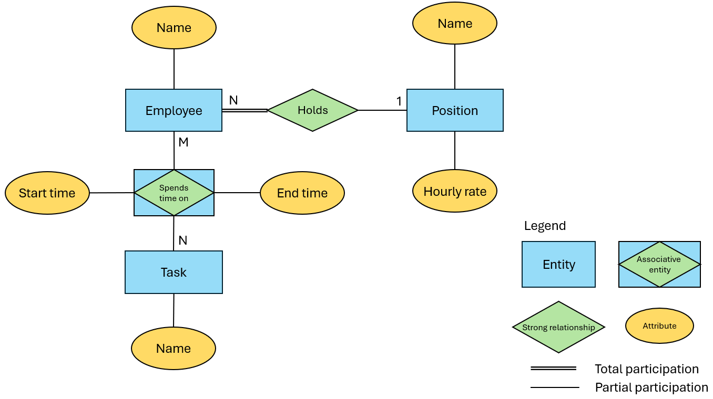

# Описание финальной работы
## Выбор СУБД. Концептуальное проектирование 
На основе технического задания была составлена ER-диаграмма в нотации Чена:

### Выбор БД:
- Схемная или бессхемная?
  
  В данной задаче набор используемых сущностей и их атрибутов определен заранее, значит можно использовать схемную БД.

- SQL или NoSQL?

  С задачей аналитических запросов по связям многие-ко-многим и многие-к-одному лучше справится реляционная SQL БД.

- Какую РСУБД выбрать?

  Для небольших проектов и чаще всего применяется СУБД MySQL, выберем ее.

## Схема данных
[schema.sql](scripts/schema.sql)

## Технические требования
- .NET 8
- MySQL
- Docker (для запуска тестов)

## Сборка проекта
1. Установить [.NET 8](https://dotnet.microsoft.com/en-us/download) 
2. Запустить `build.cmd`

После сборки исполняемые файлы будут находиться в папке `artifacts/bin`.

## Запуск программы
1. Создать БД MySQL, запустить скрипт [schema.sql](scripts/schema.sql) для создания таблиц и триггеров.
2. Настроить строку подключения к БД MySQL в файле `appsettings.json`, находящемся в папке с программой.
3. Запустить исполняемый файл `outsource-tracker.exe`.
